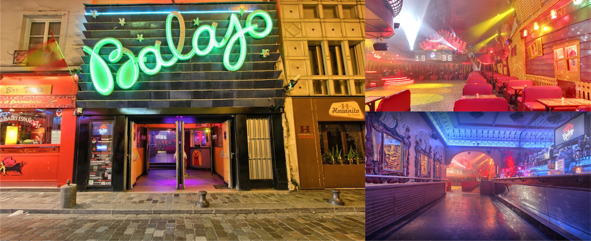

title: Social Events
author: peeters
slug: events-social
category:
tags: eventsSocial
order: 1
parent: events

In addition to the academic focus of ISMIR, we are offering a number of unique social events. The social program provides participants with an opportunity to relax after meetings, to experience Paris, and to network with other ISMIR participants. The social program includes:

## Welcome Reception

**◼ When:** Sunday 2018-09-23 from 19:30 to 24:00

**◼ What:** Welcome Reception

**◼ Where:** The Balajo [How to get there ?]({filename}/pages/venue_balajo.md)

The welcome reception will happen at the Balajo on Sunday September 23rd.
The Balajo is a historical dancing-hall in the Bastille neighbourhood opened in 1936.
It has welcomed many famous artists such as Mistinguett, Marlene Dietrich and Django Reinhardt.
We will be welcome at the Balajo by [Riton la manivelle](https://www.riton.org) one of the most representative artist of the 19th century Parisian chanson.
Inside the Balajo, we will have a private concert of [Le Broux Gipsy 4 têtes](https://www.youtube.com/watch?v=VxZE-24g80w), a Gipsy Jazz music band.
We will also have hors d’oeuvres and drinks.

## ISMIR Banquet and Jam Session

**◼ When:** Wednesday 2018-09-26 from 20:00 to 24:00

**◼ What:** Banquet

**◼ Where:** Quai de Grenelle [How to get there ?]({filename}/pages/venue_grenelle.md)

The banquet will happen Wednesday September 26th as a Seine river cruise buffet(with views over all the most famous Paris buildings).
The cruise dock will be at the root of the Eiffel tower.
The cruise will be concluded with the first ever ISMIR **Jam Session** on a boat.

