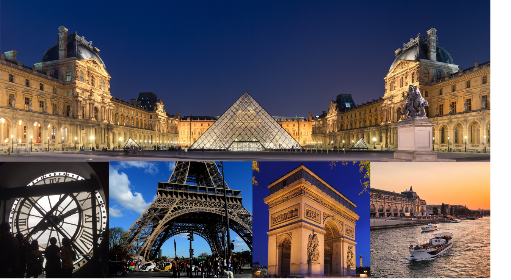

title: Venue
author: peeters-fuentes-foroughmand
slug: participants-venue
category:
tags: CIUP
order: 1
parent: participants

## ISMIR places

ISMIR-2018 will take place in several places in Paris.

- [Scientific Program]({filename}/pages/eventsMainProgram.md), [Keynotes]({filename}/pages/eventsKeynote.md), [WiMIR session]({filename}/pages/eventsWimir.md), [LBD session]({filename}/pages/eventsLBD.md)
    - Cité Internationale Universitaire de Paris (CIUP) in the Adenauer space [How to get there ?]({filename}/pages/venue_ciup.md)
- [Tutorials]({filename}/pages/eventsTutorials.md)
    - Télécom ParisTech [How to get there ?]({filename}/pages/venue_tpt.md)
- [Unconference]({filename}/pages/eventsUnconference.md)
    - Télécom ParisTech [How to get there ?]({filename}/pages/venue_tpt.md)
- [MeetUp with Industry]({filename}/pages/eventsUnconference.md)
    - Station-F [How to get there ?]({filename}/pages/venue_stationF.md)
- [Welcome Reception]({filename}/pages/eventsSocial.md)
    - Balajo [How to get there ?]({filename}/pages/venue_balajo.md)
- [Banquet and Jam Session]({filename}/pages/eventsSocial.md)  
    - Quai de Grenelle [How to get there ?]({filename}/pages/venue_grenelle.md)
- [HAMR (Hacking Audio and Music Research)]({filename}/pages/eventsHAMR.md)
    - Deezer Paris headquarters

<iframe src="https://www.google.com/maps/d/embed?mid=1ay-CpPzOi17MCHUeA44ruXxbkYRpeiXC" width="640" height="480"></iframe>

<iframe src="https://www.google.com/maps/d/embed?mid=1CYd2VY_lDkEUDaCRwDq94YWXvvTveYZb" width="640" height="480"></iframe>

## Tourist Information

</TD>

Paris is the capital and most populous city of France. Situated on the river Seine in the north of the country, it is
in the center of the Île-de-France region, also known as the r&eacute;gion parisienne, "Paris Region".
It is the home of the most visited art museum in the world, the Louvre, as well as the Mus&eacute;e d'Orsay, noted for
its collection of French Impressionist art, and the Mus&eacute;e National d'Art Moderne, a museum of modern and
contemporary art. The notable architectural landmarks of Paris include Notre Dame Cathedral (12th
century); the Sainte-Chapelle (13th century); the Eiffel Tower (1889); and the Basilica of Sacr&eacute;-Cœur on
Montmartre (1914). In 2014 Paris received 22.4 million visitors, making it one of the world's top tourist
destinations. Paris is also known for its fashion, particularly the twice-yearly Paris Fashion Week, and for its
haute cuisine, and three-star restaurants. Most of France's major universities and grandes &eacute;coles are located
in Paris

Check [here](https://en.parisinfo.com/what-to-see-in-paris/monuments) the monuments you can visit in Paris.

Check the museums and other places to visit [here](https://en.parisinfo.com/what-to-see-in-paris).
