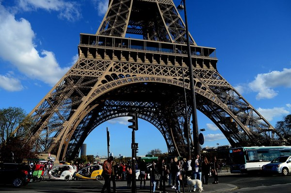
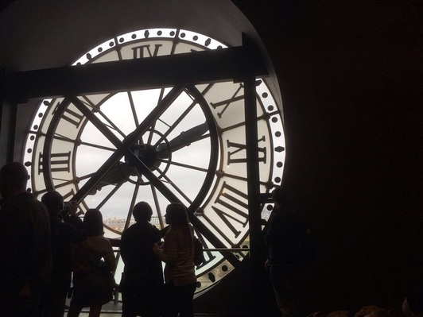

title: Venue
author: peeters-fuentes-foroughmand
slug: participants-venue
category:
tags: CIUP
order: 1
parent: participants

## Cité Internationale Universitaire de Paris (CIUP)

The main program (oral and poster sessions) will take place at the Cité Internationale Universitaire de Paris (CIUP) in the Adenauer space.

It is located at

<iframe src="https://www.google.com/maps/embed?pb=!1m18!1m12!1m3!1d2626.9990423189533!2d2.3362582511736254!3d48.820079711255886!2m3!1f0!2f0!3f0!3m2!1i1024!2i768!4f13.1!3m3!1m2!1s0x47e671a1a98df859%3A0x1c4282bc491b8270!2sCit%C3%A9+internationale+universitaire+de+Paris!5e0!3m2!1sfr!2sfr!4v1507992254146" width="600" height="450" frameborder="0" style="border:0" allowfullscreen></iframe>

<TABLE BORDER=0>
<TD></TD>
<TD></TD>
</TR>
</TABLE>

## Télécom ParisTech

[Tutorials]({filename}/pages/eventsTutorials.md) will take place at Télécom ParisTech.

It is located at

<iframe src="https://www.google.com/maps/embed?pb=!1m18!1m12!1m3!1d2626.673131061616!2d2.344224751173804!3d48.826297810818275!2m3!1f0!2f0!3f0!3m2!1i1024!2i768!4f13.1!3m3!1m2!1s0x47e671975e9d2e3d%3A0x17f35deee8ffbbf1!2zVMOpbMOpY29tIFBhcmlzVGVjaA!5e0!3m2!1sfr!2sfr!4v1507992278258" width="600" height="450" frameborder="0" style="border:0" allowfullscreen></iframe>

<TABLE BORDER=0>
<TD></TD>
<TD></TD>
</TR>
</TABLE>

## Deezer Paris headquarters

[HAMR (Hacking Audio and Music Research)]({filename}/pages/eventsHAMR.md) will take place at Deezer Paris headquarters.

It is located at

<iframe src="https://www.google.com/maps/embed?pb=!1m18!1m12!1m3!1d2623.955324483885!2d2.3261833511754455!3d48.87812820716933!2m3!1f0!2f0!3f0!3m2!1i1024!2i768!4f13.1!3m3!1m2!1s0x47e66e4a3dea325d%3A0x8c5afc188ce6af62!2sDeezer!5e0!3m2!1sfr!2sfr!4v1507992316969" width="600" height="450" frameborder="0" style="border:0" allowfullscreen></iframe>

## Tourism

Paris is plenty of monuments, museums, daily activities and night life!

Check [here](https://en.parisinfo.com/what-to-see-in-paris/monuments) the monuments you can visit in Paris.

Check the museums and other places to visit [here](https://en.parisinfo.com/what-to-see-in-paris).

A list of recommended bars and restaurants next to the main conference venue will be publish soon.

<TABLE BORDER=0>
<TD></TD>
<TD></TD>
<TD></TD>
</TR>
</TABLE>
