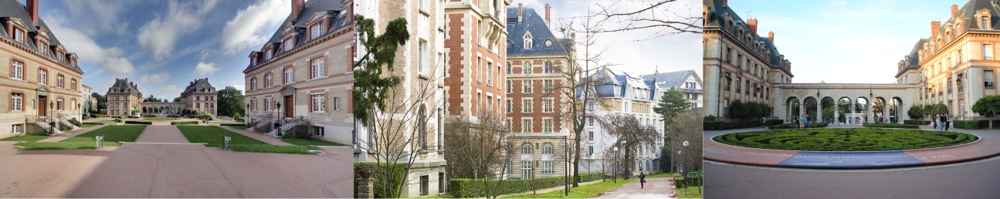

title: Venue / Cité Internationale Universitaire de Paris
author: peeters
slug: venueCIUP
category:
tags: venueCIUP

The Cité Internationale Universitaire de Paris is located at: 17 Boulevard Jourdan, 75014 Paris

<iframe src="https://www.google.com/maps/d/embed?mid=1Y65x7zX0p63slcYuT5P0FAROK5WsK6l5" width="640" height="480"></iframe>

The International University Campus in Paris is a private foundation, recognised as being in the public interest since 1925 and closely linked to the Paris universities, which own the buildings and  which are represented at its Management Board by the Rector of the Academy and Chancellor of the Universities of Paris, Acting Vice-President of the Foundation and the Presidents of two universities.

Ever since the Middle Ages the University of Paris has always welcomed students from all over the world. In what they used to call the “College of Nations”. When the international university campus in Paris was created in 1925 it continued this tradition of the Paris universities: a tradition of welcome. The International University Campus in Paris plays a central role in the policy for accepting internationally mobile students in the Ile-de-France. Check [here](http://www.ciup.fr/en/) for more information.

</TD>

The conference will take place in the **Adenauer space** in the Cité Internationale Universitaire.

</TD>

## From Télécom ParisTech to CIUP

</TD>
