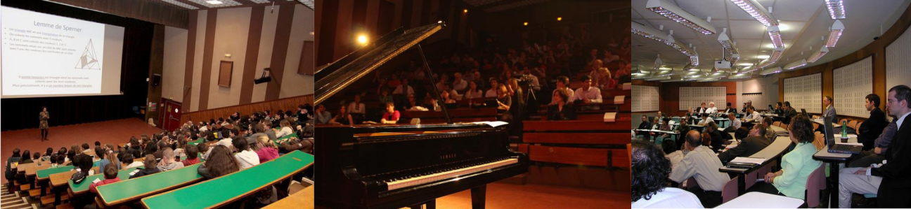

title: Venue / Télécom ParisTech
author: peeters
slug: venue-tpt
category:
tags: venueTPT

Télécom ParisTech is located at: 46 rue Barrault, Paris 13ème

<iframe src="https://www.google.com/maps/d/embed?mid=1Y65x7zX0p63slcYuT5P0FAROK5WsK6l5" width="640" height="480"></iframe>

Télécom ParisTech is one of France's leading graduate engineering schools. It is located at 46 rue Barrault, in the 13th
arrondissement (zone) of Paris in a nice area called “La Butte aux Cailles”, which is often described as a
traditional village in Paris. The immediate neighborhood is rich of bars, restaurants, shops
and supermarkets, the closest ones being right in front of the school main entrance, that is no further than 1
minute walking distance away from the conference rooms.

Commuting to Télécom ParisTech is very easy thanks to the dense network of public transportation in Paris and
the numerous metro and bus stations at walking distance (see map above).

## From CIUP to Télécom ParisTech

## TPT entrance

